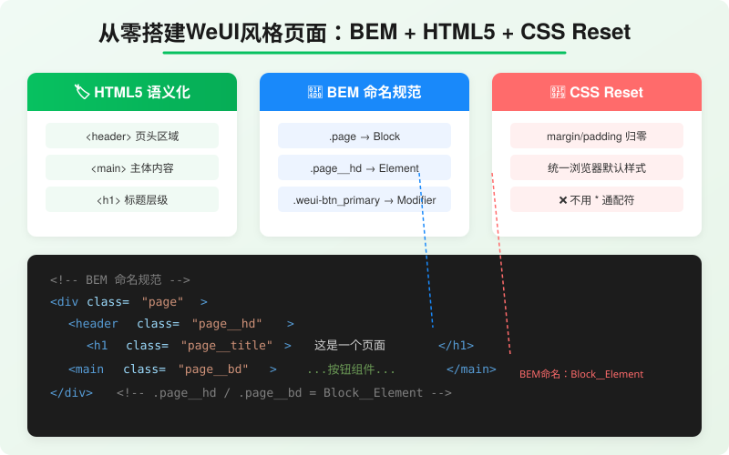
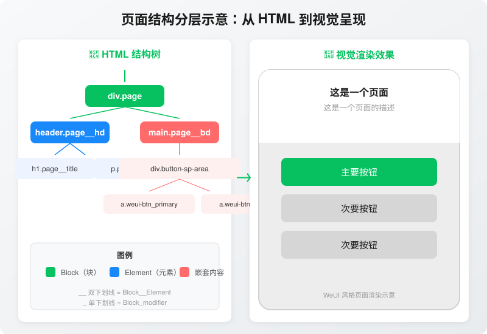
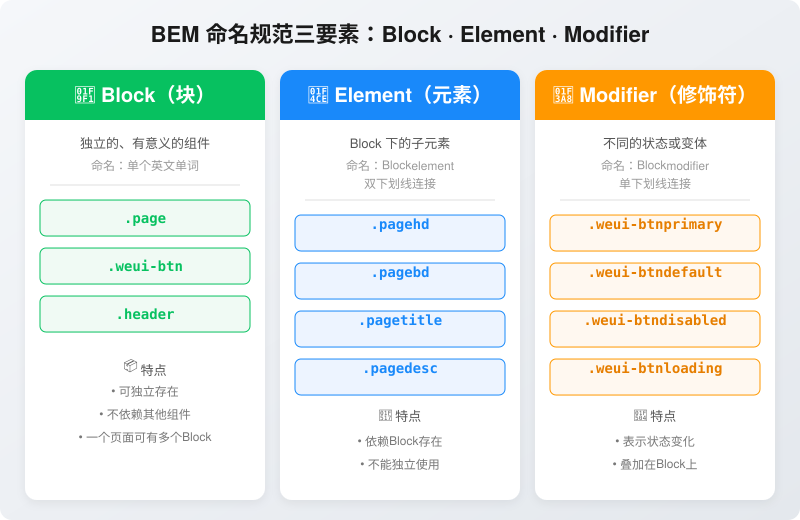
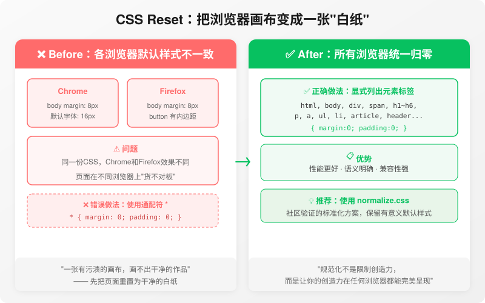
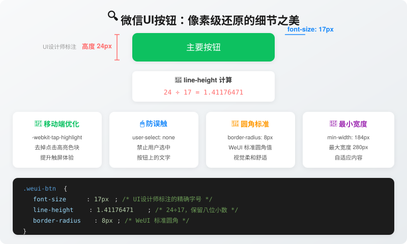
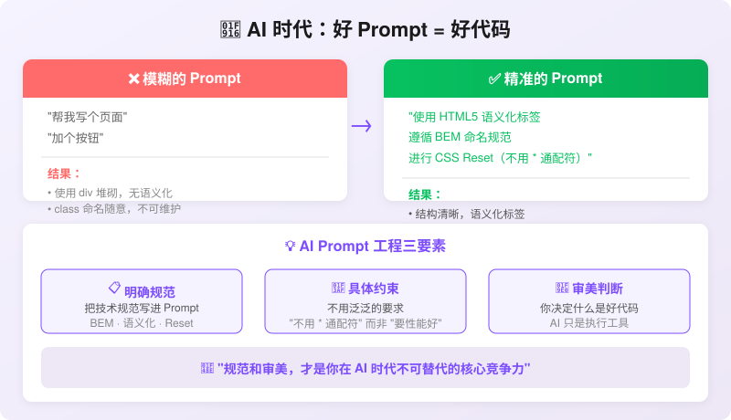

# 📸 文章配图位置说明

本文共使用 **6 张 SVG 矢量配图**，全部存放在当前文件夹中。以下是对应位置：

---

## 图片 1：`img_page_overview.svg` — BEM 页面结构总览

**插入位置**：前言末尾，"从结构到样式"段落后

**文章中对应的文本位置**：
> ...分享那些看似基础却决定前端工程师段位的关键知识点。
>
> 
>
> ## 一、先写结构，再写样式

**图片内容**：三大核心知识卡片（HTML5语义化、BEM命名、CSS Reset）+ 底部代码预览区，起全文"海报图"作用。

---

## 图片 2：`img_page_layout.svg` — 页面结构分层示意

**插入位置**：第一部分 "一、先写结构，再写样式" 的代码块之后

**文章中对应的文本位置**：
> ...代码首先是写给人看的，其次才是给机器执行的。
>
> 
>
> ## 二、HTML5语义化标签

**图片内容**：左侧 HTML 结构树（Block→Element 层级），右侧 iPhone 风格页面渲染效果。

---

## 图片 3：`img_bem_structure.svg` — BEM 命名规范图解

**插入位置**：第三部分 "三、BEM命名规范" 中，表格之后

**文章中对应的文本位置**：
> ...用一种约定俗成的符号体系，优雅地解决了这个难题。
>
> 
>
> BEM将页面拆解为三个核心层级：

**图片内容**：三栏对比（Block🧱 / Element📎 / Modifier🎨），每栏有具体代码示例和特点说明。

---

## 图片 4：`img_css_reset.svg` — CSS Reset 对比示意

**插入位置**：第四部分 "四、CSS Reset" 中，解释目的之后

**文章中对应的文本位置**：
> ...然后你在这张白纸上自由创作。
>
> 
>
> 这里有一个重要的**性能注意事项**...

**图片内容**：左侧"Before"各浏览器默认样式差异，右侧"After"统一归零的干净状态，含错误做法对比。

---

## 图片 5：`img_button_detail.svg` — 按钮像素还原详解

**插入位置**：第五部分 "五、微信UI细节" 中，开头段落之后

**文章中对应的文本位置**：
> ...有几个值得所有前端工程师学习的细节：
>
> 
>
> ```css
> .weui-btn {
>   font-size: 17px;
> ```

**图片内容**：绿色按钮视觉稿 + 尺寸标注（高度24px、字号17px）+ line-height计算公式 + 四项细节卡片 + 底部代码预览。

---

## 图片 6：`img_ai_prompt.svg` — AI Prompt 工程流程

**插入位置**：第六部分 "六、AI时代的Prompt工程" 中，三条规范之后

**文章中对应的文本位置**：
> 3. ✅ 进行CSS Reset（不使用通配符 `*`）
>
> 
>
> **这就是"好的Prompt"——不是模糊地说...**

**图片内容**：左侧"模糊Prompt" vs 右侧"精准Prompt"对比，底部 Prompt 工程三要素（明确规范/具体约束/审美判断）。

---

## 📝 发布到稀土掘金时的注意事项

1. **SVG 直接上传**：稀土掘金编辑器支持 SVG 图片上传，可直接拖入。
2. **或者转换为 PNG**：如果需要更高兼容性，用浏览器打开 SVG 后截图保存为 PNG。
3. **alt 文本**：每张图务必填写有意义的 alt 文本（已在上方标注），利于 SEO 和无障碍访问。
4. **封面图建议**：推荐使用 `img_page_overview.svg` 作为文章封面图。
