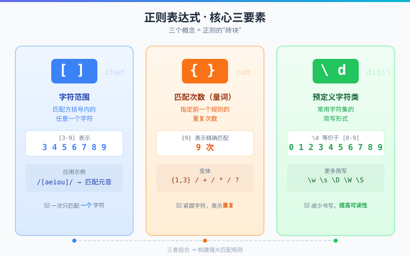
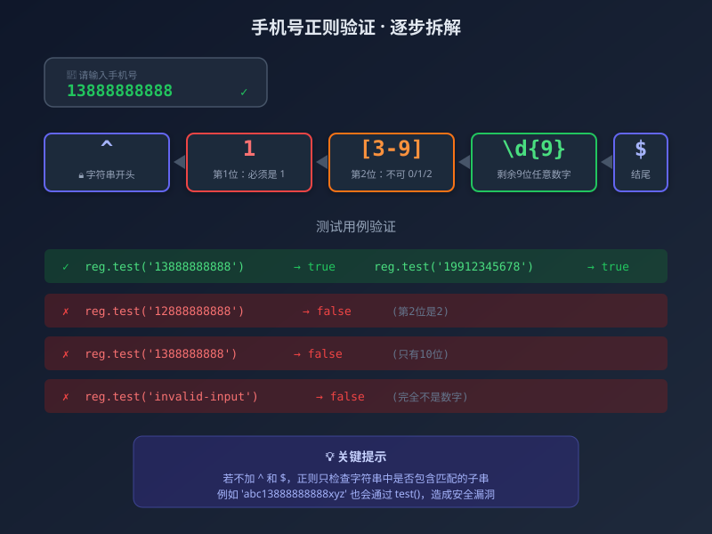
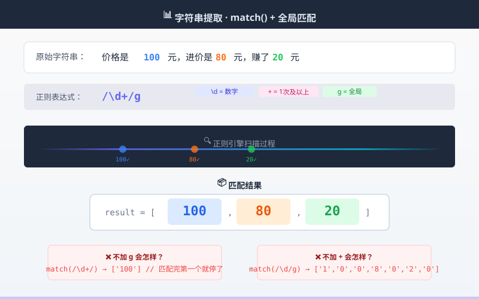
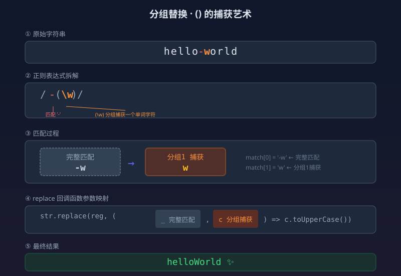
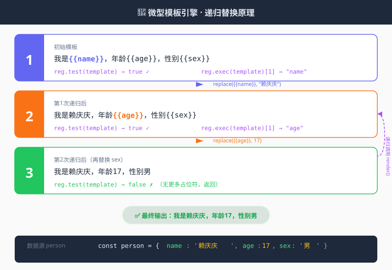
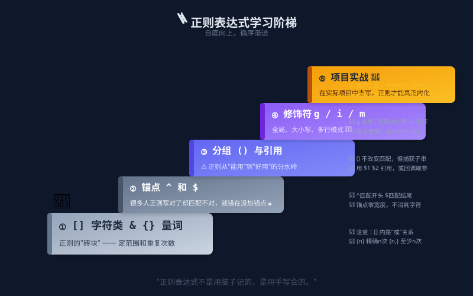

# 从零掌握 JavaScript 正则表达式 —— 从手机号验证到模板引擎，一文吃透 RegExp

> 正则表达式（Regular Expression）是每个前端工程师都绕不开的基本功。它既像一把精准的手术刀，能在混乱的字符串中精准匹配目标；又像一门晦涩的"外星语言"，让初学者望而生畏。本文以拼多多真实笔试题为切入点，从零带你吃透 JS 正则的核心玩法。


---

## 一、你为什么需要正则表达式？

想象一个场景：用户在注册页面填了一个手机号 —— `13888888888`。你怎么知道它是不是一个合法的手机号？

你可能想说：判断一下长度是不是 11 位，每一位是不是数字，不就行了？

但实际情况远比这复杂。用户可能输入 `138 8888 8888`（带空格）、`138-8888-8888`（带分隔符）、甚至 `1388888888a`（混入字母）。**永远不要相信用户的输入** —— 这是每一个开发者都该刻进 DNA 里的信条。

而**正则表达式正是用来描述"模式"的数学语言**。它让我们能够在一行代码里，完成对字符串的匹配、提取和替换。

---

## 二、正则表达式基础三要素

在 JS 中，正则表达式长这样：

```js
/pattern/flags
```

两斜杠之间是匹配模式，斜杠之后是修饰符。要理解正则，只需要先记住三个核心概念：

| 概念 | 语法 | 含义 | 示例 |
|------|------|------|------|
| **字符范围** | `[]` | 匹配方括号内的任意一个字符 | `[3-9]` 匹配 3~9 中的任意一位 |
| **匹配次数** | `{}` | 指定前一个规则的重复次数 | `{9}` 表示恰好重复 9 次 |
| **预定义字符** | `\d` `\w` 等 | 常用字符集的简写 | `\d` 等价于 `[0-9]` |

补充两个"锚点"：

- `^` —— 匹配字符串的开头
- `$` —— 匹配字符串的结尾

这三个要素组合起来，就能构建出强大的匹配规则。



---

## 三、实战一：手机号验证 —— 从需求到正则

这是拼多多的一道真实面试题。

**需求拆解：**
1. 必须是 11 位数字
2. 第 1 位必须是 `1`
3. 第 2 位不可以是 `0`、`1`、`2`
4. 剩余 9 位可以是任意数字

**逐步推导：**

```
第1位 → 1
第2位 → [3-9]      （排除 0、1、2，即 3~9）
剩余9位 → \d{9}     （\d 表示数字，{9} 表示重复9次）
加上锚点 → ^1[3-9]\d{9}$
```

最终正则：

```js
const reg = /^1[3-9]\d{9}$/;

reg.test('13888888888');  // true  ✅
reg.test('12888888888');  // false ❌ (第二位是2)
reg.test('1388888888');   // false ❌ (只有10位)
reg.test('13888888888a'); // false ❌ (末尾混入字母)
```

这里有三个容易忽略的细节：

1. **`^` 和 `$` 不能省**。不加锚点，`'a13888888888b'` 也会通过，因为字符串中"包含"了匹配的子串。
2. **`test()` 是正则的方法**，返回布尔值，适合做校验。
3. **正则本身也是对象**。用 `typeof reg` 会返回 `'object'`（这在某些历史环境中可能返回 `'function'`），用 `Object.prototype.toString.call(reg)` 可以得到 `'[object RegExp]'`。



---

## 四、实战二：提取字符串中的数字

场景：从 `'价格是100元，进价是80元，赚了20元'` 中提取出所有金额。

这里引入两个新概念：

| 概念 | 语法 | 含义 |
|------|------|------|
| **修饰符 g** | `/pattern/g` | 全局匹配 —— 找到所有匹配项，而不是在第一个匹配后停下 |
| **量词 +** | `+` | 匹配一次或多次，等价于 `{1,}` |

于是：

```js
const str = '价格是100元，进价是80元，赚了20元';
const reg = /\d+/g;
const result = str.match(reg);
console.log(result); // ['100', '80', '20']
```

关键理解：
- **`\d`** 只匹配**一个**数字字符。不加 `+`，你将得到 `['1','0','0','8','0','2','0']`。
- **`g` 修饰符**让 `match()` 不会在第一个 `100` 之后就停下来。
- `match()` 是字符串的方法，参数是正则，返回匹配结果数组。

### 4.1 引申：贪婪匹配与惰性匹配

这是正则中一个极易踩坑的概念。看下面两个例子：

```js
const str = '<div>hello</div><div>world</div>';

// 贪婪匹配（默认）—— 尽可能多地匹配
str.match(/<div>.*<\/div>/g);
// 结果：['<div>hello</div><div>world</div>']  ← 一口气吞到底！

// 惰性匹配（加 ?）—— 尽可能少地匹配
str.match(/<div>.*?<\/div>/g);
// 结果：['<div>hello</div>', '<div>world</div>']  ← 逐个匹配
```

**规律**：在量词 `*`、`+`、`?`、`{}` 后再加一个 `?`，就能将贪婪模式切换为惰性模式。这个技巧在解析 HTML 片段、提取 JSON 字符串等场景中非常实用。



---

## 五、实战三：字符串替换 —— 分组捕获的艺术

场景：把 `'hello-world'` 转换成驼峰命名 `'helloWorld'`。

这里需要用到正则中最重要的高级特性：**分组捕获**。

### 5.1 什么是分组？

用 `()` 将正则的一部分括起来，就形成了一个"分组"。分组有两个作用：
- **不改变匹配规则** —— `/-(\w)/` 和 `/-\w/` 匹配的内容完全一致
- **额外捕获** —— 括号内的匹配结果会被单独"提取"出来

### 5.2 代码实现

```js
const str = 'hello-world';
const reg = /-(\w)/;

const res = str.replace(reg, (_, c) => {
  return c.toUpperCase();
});

console.log(res); // 'helloWorld'
```

逐步拆解：
1. `reg` 匹配到了 `'-w'`（连字符 + 一个单词字符）
2. `(\w)` 分组捕获了 `'w'`
3. `replace` 的回调函数接收：第一个参数 `_` 是完整匹配 `'-w'`，第二个参数 `c` 是分组捕获的 `'w'`
4. 我们将 `c` 转成大写并返回，完成替换

### 5.3 分组引用的快捷写法

也可以用 `$1` 来引用第一个分组：

```js
'hello-world'.replace(/-(\w)/, (_, c) => c.toUpperCase());
// 等价于更简洁的写法：
// 'hello-world'.replace(/-(\w)/g, (_, c) => c.toUpperCase());
```

> **进阶思考**：如果需要处理 `'hello-world-example'` 这样的多段短横线命名，只需要把修饰符改成 `g`，每次匹配的回调都会逐个处理每个 `-x` 组合。



---

## 六、进阶实战：手写一个微型模板引擎

理论知识学完了，我们来做一个有实际价值的案例 —— 用正则实现一个**模板字符串渲染函数**。

**需求**：将 `'我是{{name}}，年龄{{age}}，性别{{sex}}'` 中的占位符替换为实际数据。

```js
const template = '我是{{name}}，年龄{{age}}，性别{{sex}}';
const person = {
  name: '赖庆庆',
  age: 17,
  sex: '男'
};
```

### 6.1 正则设计

占位符格式是 `{{xxx}}`，我们需要匹配并捕获中间的变量名：

```js
const reg = /\{\{(\w+)\}\}/;
```

拆解：
- `\{\{` —— 匹配两个左花括号（花括号在正则中有特殊含义，需要转义）
- `(\w+)` —— 分组捕获一个或多个单词字符（即变量名）
- `\}\}` —— 匹配两个右花括号

### 6.2 递归替换实现

```js
function render(template, data) {
  const reg = /\{\{(\w+)\}\}/;
  if (reg.test(template)) {
    const name = reg.exec(template)[1];  // 提取变量名
    template = template.replace(reg, data[name]); // 替换
    return render(template, data);  // 递归处理剩余占位符
  }
  return template;
}

console.log(render(template, person));
// 输出：'我是赖庆庆，年龄17，性别男'
```

**设计亮点**：

1. **`exec()` 方法的妙用** —— 它返回的数组第 0 项是完整匹配，第 1 项是第一个分组捕获的内容（即变量名）。
2. **递归思想** —— `replace` 每次只替换第一个匹配项（不带 `g` 修饰符），然后递归调用自己，直到没有更多占位符。这种"一次替换一个，剩余递归"的模式，天然避免了复杂的状态管理。
3. **纯函数设计** —— 不修改原始数据，每次递归都返回新的 `template` 值。

### 6.3 进阶思考：不用递归的替代方案

如果你不喜欢递归，也可以借助 `replace` 的回调函数 + `g` 修饰符一步到位：

```js
function renderOnce(template, data) {
  return template.replace(/\{\{(\w+)\}\}/g, (match, key) => {
    return data[key] || match; // 找不到则保留原样
  });
}
```

这种写法利用了 `g` 修饰符让 `replace` 自动遍历所有匹配项，代码更简洁。**但递归版本也有其价值**——它展示了"一次只处理一个问题、剩余交给下一次"的编程思想，这也是函数式编程与编译原理中常见的模式。两者都值得掌握。



---

## 七、核心 API 速查表

| 方法 | 所属 | 作用 | 返回值 |
|------|------|------|--------|
| `reg.test(str)` | RegExp | 检测字符串是否匹配 | `boolean` |
| `reg.exec(str)` | RegExp | 执行匹配并返回详细信息 | `Array` 或 `null` |
| `str.match(reg)` | String | 获取匹配结果 | `Array` 或 `null` |
| `str.replace(reg, newStr\|fn)` | String | 替换匹配内容 | 新字符串 |

> **一句话区分**：`test` 回答"有没有"，`exec` 回答"匹配了什么（含分组）"，`match` 回答"匹配了哪些"，`replace` 负责"替换掉匹配的内容"。

---

## 八、学习路径与避坑建议

### 8.1 推荐学习顺序

1. **先理解字符类 `[]` 和量词 `{}`** —— 正则的"砖块"
2. **再用好锚点 `^` 和 `$`** —— 很多人正则写对了却匹配不对，错就错在没加锚点
3. **掌握分组 `()` 和引用** —— 这是正则从"能用"到"好用"的分水岭
4. **理解修饰符 `g`、`i`、`m`** —— 全局、大小写、多行模式
5. **学以致用** —— 在实际项目中去写，正则才能真正内化

### 8.2 常见误区

- ❌ **正则能匹配就行，不用管性能** → 灾难性回溯（Catastrophic Backtracking）可能导致页面卡死
- ❌ **用正则解析 HTML** → HTML 不是正则语言，请用 DOM 解析器
- ❌ **一个正则解决所有问题** → 复杂校验拆成多个简单正则 + 代码逻辑，可读性更好



---

## 九、总结

回顾我们从零走完的这段旅程：

1. **正则基础** —— `[]` 定范围，`{}` 定次数，`\d` 是数字，`^$` 定边界
2. **手机号验证** —— `/^1[3-9]\d{9}$/`，每一步推导都有业务逻辑支撑
3. **字符串提取** —— `match()` + `g` 修饰符 + `\d+` 量词，一步拿到所有数字
4. **字符串替换** —— `replace()` + 分组 `()`，灵活转换字符串格式
5. **模板引擎** —— `exec()` + 递归，正则驱动的小型 DSL 解析器

正则表达式不是一门需要死记硬背的学问。**它就是一套描述字符串模式的语言** —— 当你把需求拆解成"第几位是什么、重复几次、从哪里开始到哪里结束"时，正则自然而然就能写出来。

希望读完这篇文章，你不再对正则感到恐惧，反而能享受用一行代码解决复杂字符串问题的那种**优雅的快感**。

---

> **参考资料**
> - [MDN - Regular Expressions](https://developer.mozilla.org/en-US/docs/Web/JavaScript/Guide/Regular_Expressions)
> - [JavaScript RegExp 对象](https://developer.mozilla.org/en-US/docs/Web/JavaScript/Reference/Global_Objects/RegExp)

---

*本文基于拼多多前端面试真题整理，代码示例均可在浏览器控制台直接运行验证。*
